# Bahaa Medhat Wanas - Portfolio

Welcome to my portfolio! This README highlights my skills, projects, and certifications as a data analyst.

## Table of Contents
1. [About Me](#about-me)  
2. [Skills](#skills)  
3. [Projects](#projects)  
   - [MySQL Projects](#mysql-projects)  
   - [Power BI Projects](#power-bi-projects)  
   - [Excel Projects](#excel-projects)  
4. [Certifications](#certifications)  
5. [Contact and CV](#contact-and-cv)  

---

## About Me
Hi! I'm **Bahaa Medhat Wanas**, a junior data analyst with a strong foundation in data analysis and visualization. I graduated from the Faculty of Artificial Intelligence, Kafr Elsheikh University in 2024 with **3.16(B)** GPA, and I am currently enrolled in the ALX Data Science track. I am passionate about leveraging data to uncover insights and drive decision-making.

---

## Skills
- **Data Visualization Tools**: Power BI (including Power Query, Dax, Data Modeling, Dynamic Charts)
- **Data Manipulation and Analysis**: Excel (including Power Query, Power Pivot, Data Modeling)
- **Database Management**: MySQL
- **Other Tools**: Figma (for design)
- **Programming Languages**: Python
- **Soft Skills**: Problem-solving, critical thinking, collaboration, and communication

---

## Projects
### MySQL Projects
1. **[Library Management System Project](https://github.com/BahaaMedhat1/Library-Management-System-Using-MySQL?tab=readme-ov-file#library-management-system-project)**
   - This project is a Library Management System developed using MySQL to efficiently manage and analyze library operations. It includes database creation, schema design, data loading, and advanced querying to handle tasks such as book tracking, branch performance analysis, and member management.
   - 

2. **[Netflix Movies Analysis](https://github.com/BahaaMedhat1/Analyzing-Netflix-Movies-using-MySQL?tab=readme-ov-file#netflix-movies-analysis-)**
   - This project leverages MySQL to analyze the Netflix dataset, aiming to uncover trends, insights, and patterns about Netflix's movie and TV show offerings. The dataset, netflix_titles.csv, contains comprehensive information about Netflix's catalog, including title details, ratings, release years, genres, and more.
   - 

3. **[Spotify Analysis Project](https://github.com/BahaaMedhat1/Spotify-Tracks-Analyzing-using-MySQL?tab=readme-ov-file#spotify-analysis-project)**
   - This project involves analyzing Spotify data using MySQL. The aim is to explore and derive insights about tracks, artists, and albums by creating a structured database schema, performing exploratory data analysis (EDA), and running advanced SQL queries.
   - 

4. **[Coffee Shop Sales Analysis Project](https://github.com/BahaaMedhat1/Coffee-Shop-Analysis-using-MySQL?tab=readme-ov-file#coffee-shop-sales-analysis-project)**
   - This project is a Coffee Shop Sales Analysis system developed using MySQL to analyze sales performance, customer behavior, and product popularity. It includes database schema creation, data loading, and a series of exploratory data analysis (EDA) queries to derive actionable insights for business decision-making.
   - 

5. **[Walmart Sales Analysis](https://github.com/BahaaMedhat1/Analysing-WalMart-Sales-Using-MySQL?tab=readme-ov-file#walmart-sales-analysis)**
   - This project involves analyzing Walmart sales data using MySQL to uncover key insights into sales performance, customer behavior, and product trends. The goal is to demonstrate advanced data wrangling, feature engineering, and analysis techniques while providing actionable insights for business decision-making.
   - 

6. **[Data Cleaning with MySQL](https://github.com/BahaaMedhat1/Data-Cleaning-with-MySQL?tab=readme-ov-file#data-cleaning-with-mysql)**
   - This project demonstrates a systematic approach to cleaning data using SQL on MySQL. The dataset contains various issues typical of real-world data, such as duplicate records, inconsistent formatting, and unnecessary whitespace. The steps in this project illustrate effective SQL techniques to identify and resolve these issues.
   - 

### Power BI Projects
1. **[Sales Overview Report](https://github.com/BahaaMedhat1/Sales-Overview-Report-using-Power-BI?tab=readme-ov-file#sales-overview-report)**
   - This project showcases a dynamic Sales Overview Dashboard built using Power BI. The dashboard is designed to provide insightful analysis of key performance indicators (KPIs) such as Sales, Profit, and Quantity across four regions: Central, East, South, and West.
   - 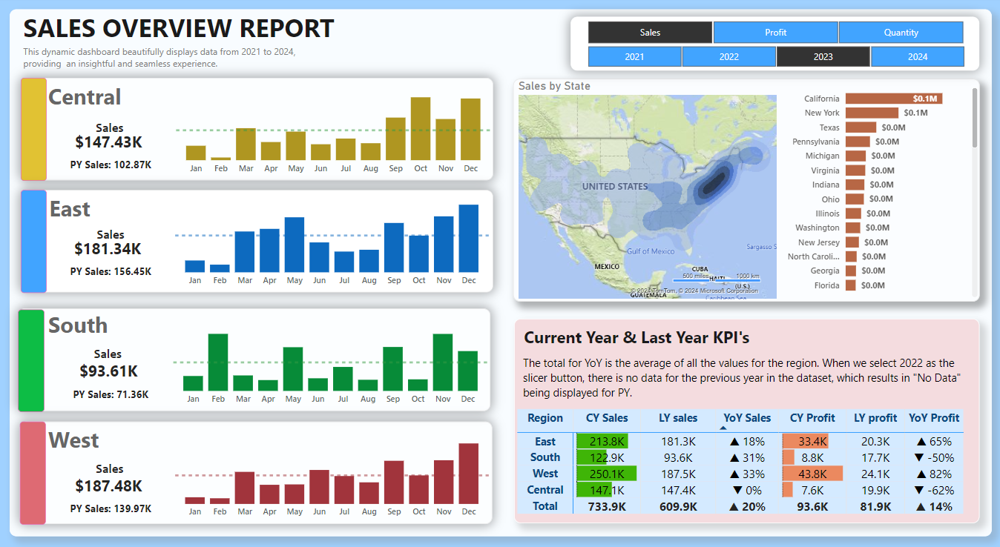

2. **[Call Center Dashboard](https://github.com/BahaaMedhat1/Call-Center-Dashboard-with-Power-Bi?tab=readme-ov-file#call-center-dashboard)**
   - This repository showcases a Call Center Dashboard developed using Power BI. The dashboard provides insights into call center performance through key metrics, charts, and detailed call records, enabling effective monitoring and decision-making.
   - 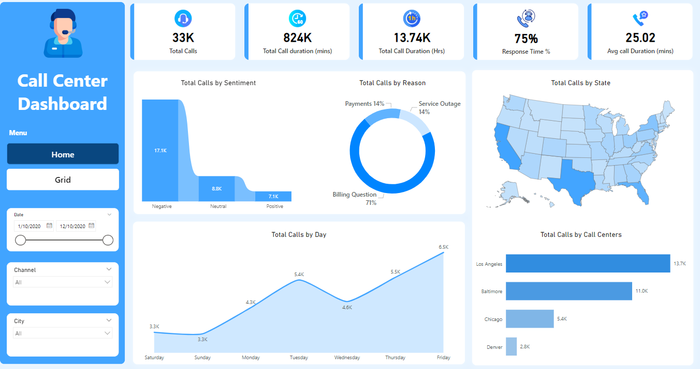

3. **[Road Accident Analysis in England (2022-2023)](https://github.com/BahaaMedhat1/Road-Accident-Analysis-using-Power-Bi?tab=readme-ov-file#road-accident-analysis-in-england-2022-2023)**
   - This project delivers a comprehensive analysis of road accidents in England for 2022 and 2023. The objective was to create an interactive Power BI dashboard that provides actionable insights into accident trends, aiding stakeholders in identifying patterns and areas for safety improvement.
   - 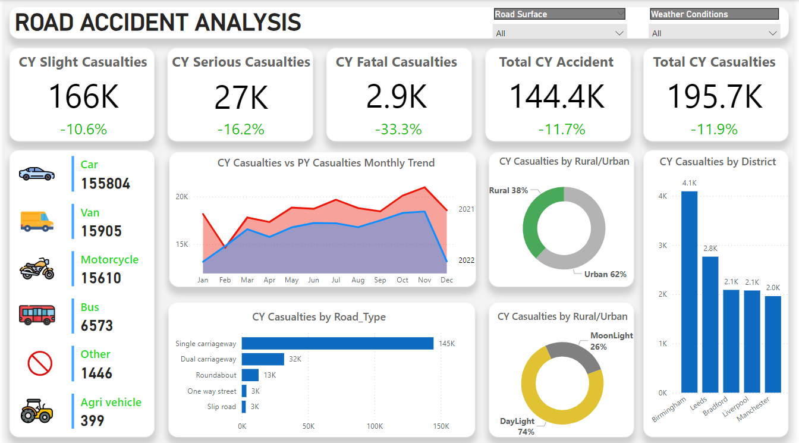

4. **[Pizza Sales Dashboard](https://github.com/BahaaMedhat1/Pizza-Sales-Using-Power-BI?tab=readme-ov-file#pizza-sales-dashboard)**
   - This repository features a Pizza Sales Dashboard built using Power BI. The dashboard provides insights into pizza sales trends, customer preferences, and business performance through key metrics, interactive charts, and visualizations.
   - 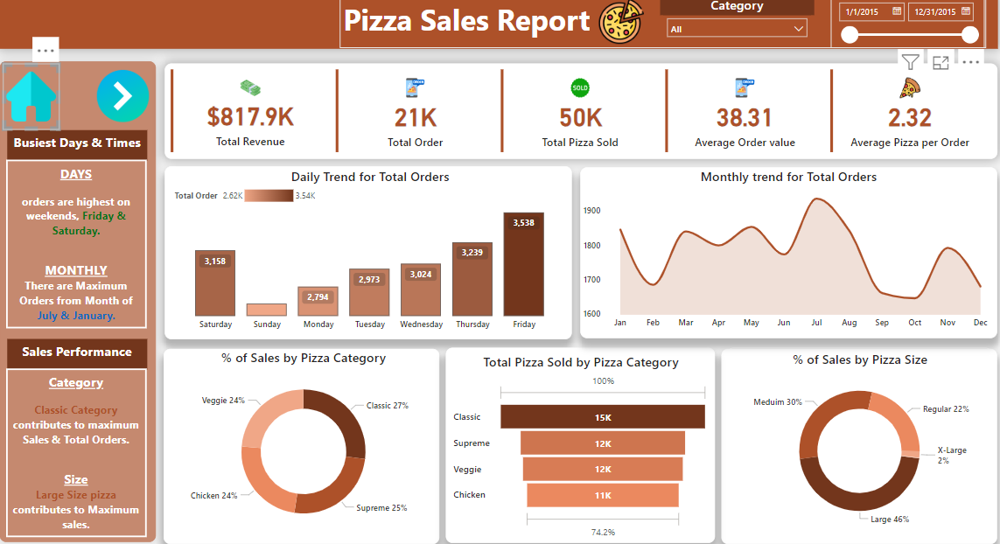

5. **[E-commerce Sales Analysis Dashboard](https://github.com/BahaaMedhat1/Ecommerce-Analysis-with-Power-BI?tab=readme-ov-file#e-commerce-sales-analysis-dashboard)**
   - This project is about creating an interactive Power BI dashboard to help an e-commerce business analyze and understand its sales data. The dashboard focuses on key metrics like sales trends, profit margins, and product performance. It’s designed to give businesses insights that can help them make smarter decisions to improve sales and grow their business.
   - 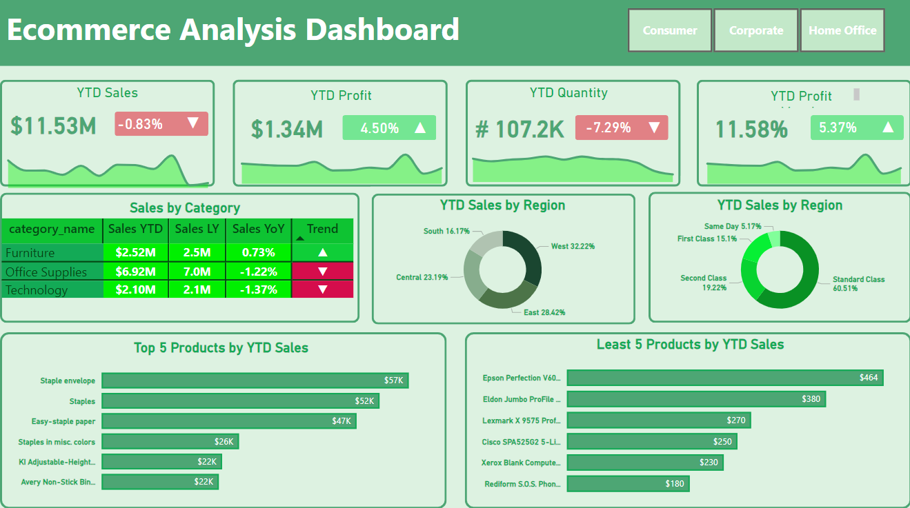

6. **[HR Analytics Dashboard Project](https://github.com/BahaaMedhat1/HR-Dashboard-using-Power-BI?tab=readme-ov-file#hr-analytics-dashboard-project)**
   - This project involves an HR Analytics Dashboard developed in Power BI to analyze employee data, focusing on metrics such as attrition rates, employee demographics, satisfaction ratings, and departmental performance. The goal is to provide actionable insights to HR teams for strategic decision-making, particularly in addressing employee turnover.
   - 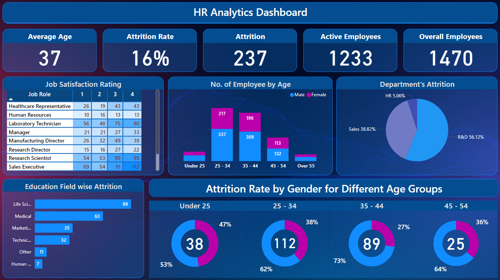

7. **[Car Sales Analysis Dashboard](https://github.com/BahaaMedhat1/Car-Sales-Analysis-using-Power-BI?tab=readme-ov-file#car-sales-analysis-dashboard)**
   - The "Car Sales Analysis Dashboard" is a comprehensive analytical tool built using Power BI to provide valuable insights into car sales data. This project helps businesses, analysts, and stakeholders understand sales trends, identify high-performing regions, and make data-driven decisions. The dashboard focuses on year-to-date (YTD) metrics, comparisons, and visual representations to enhance data interpretation.
   - 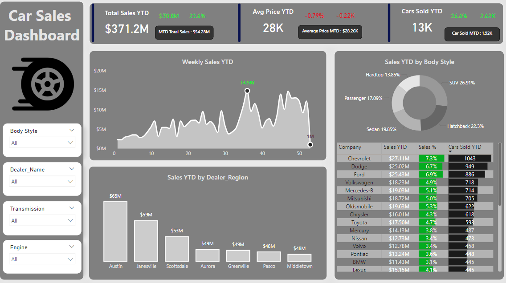

### Excel Projects
1. **[Blinkit Grocery Analysis Dashboard](https://github.com/BahaaMedhat1/Blinkit-Grocery-Analysis-using-Excel?tab=readme-ov-file#blinkit-grocery-analysis-dashboard)**
   - This project features a Blinkit Grocery Analysis Dashboard built using Excel. The dashboard provides actionable insights into grocery sales trends, outlet performance, and customer preferences, enabling data-driven decision-making for improved business outcomes.
   - 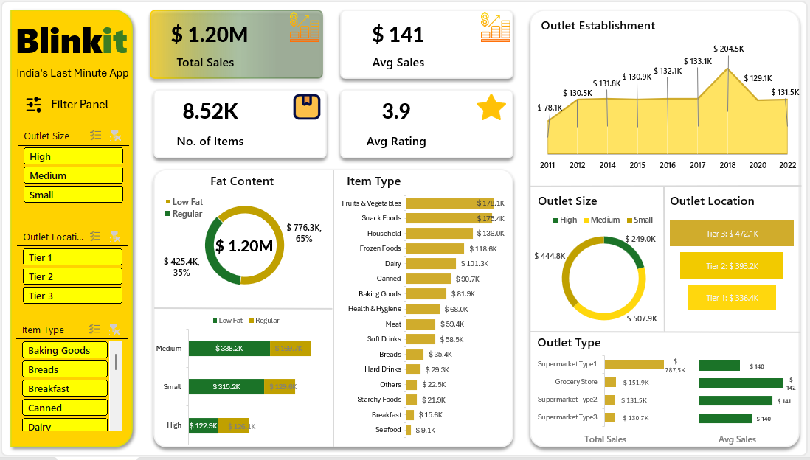

2. **[Bank Loan Analysis Dashboard](https://github.com/BahaaMedhat1/Bank-Loan-Analysis-Dashboard-Using-Excel?tab=readme-ov-file#bank-loan-analysis-dashboard)**
   - This project involves a comprehensive Bank Loan Analysis Dashboard created using Excel. The dashboard provides insights into key loan performance metrics, helping stakeholders understand and evaluate the financial health of the lending portfolio.
   - 

3. **[HR Attrition Dashboard](https://github.com/BahaaMedhat1/HR-Report-using-Excel?tab=readme-ov-file#hr-attrition-dashboard-)**
   - This HR Attrition Dashboard, built using Microsoft Excel, provides a comprehensive analysis of employee attrition within an organization. It visualizes attrition trends       across various categories, enabling HR teams to identify key patterns and take proactive measures to improve employee retention.
   - 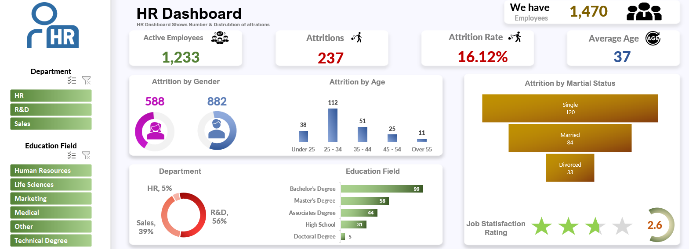

     
4. **[Ecommerce Sales Analysis Dashboard](https://github.com/BahaaMedhat1/Ecommerce-Sales-Analysis-using-Excel?tab=readme-ov-file#ecommerce-sales-analysis-dashboard)**
   - The Ecommerce Sales Analysis Dashboard is a dynamic and interactive Excel-based tool designed to provide insights into key sales metrics for an eCommerce business. This       dashboard visually represents sales, profit, quantity sold, orders, and category-wise performance across different dimensions such as time, geography, and product             categories.
   - 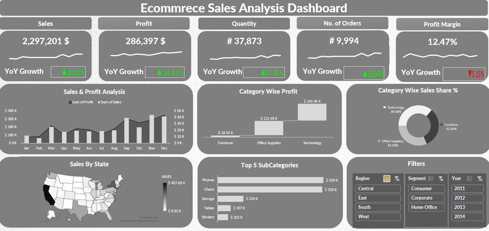

     
---

## Certifications

1. **Bachelor’s Degree in Artificial Intelligence**  
   - Graduated from the Faculty of Artificial Intelligence, Kafr Elsheikh University Jul 2024.  
   - 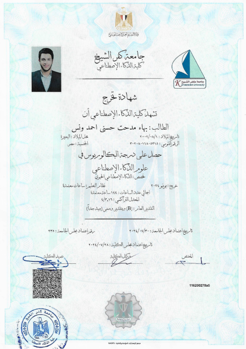  

2. **Egypt - FWD Certificates**  
   - **Data Analysis Challenger Track**  
     - Sponsored by the **Ministry of Communications and Information Technology of Egypt** in collaboration with Udacity.  
     - This program focused on building a strong foundation in data analysis, including data cleaning, visualization, and exploratory data analysis using tools like Python, Pandas, and Matplotlib.  
     - 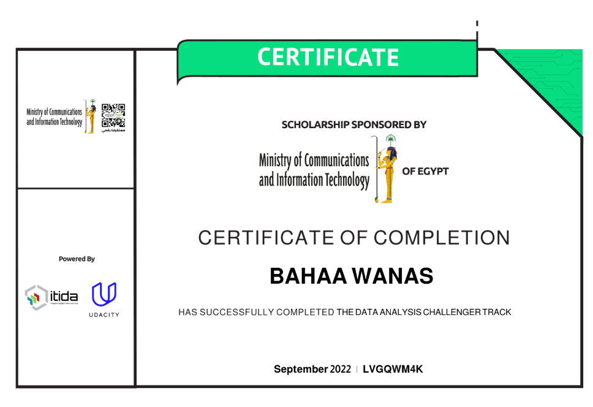  

   - **Data Analysis Professional Nanodegree**  
     - Offered by **Udacity** and sponsored by the **Ministry of Communications and Information Technology of Egypt**.  
     - This program provided in-depth knowledge of advanced data analysis techniques, including predictive modeling, data storytelling, and project-based learning with real-world datasets.  
     - 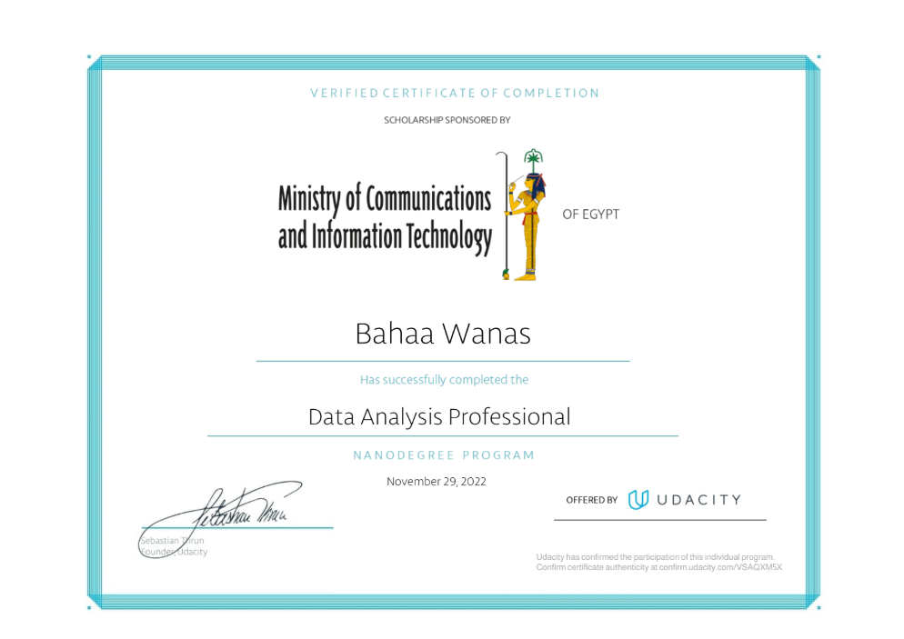  

3. **DataCamp Certifications**  
   - **Python Data Science Toolbox (Part 1)**  
     - Successfully completed a 3-hour course focusing on Python functions, error handling, and advanced function techniques.  
     - 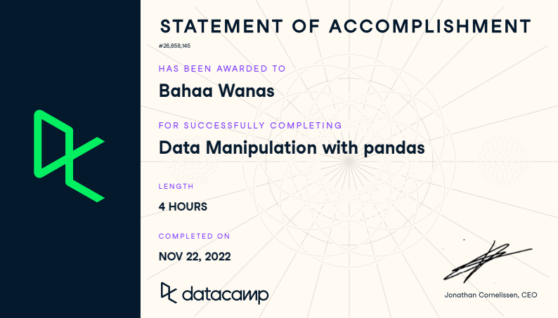  

   - **Python Data Science Toolbox (Part 2)**  
     - Successfully completed a 4-hour course covering iterators, list comprehensions, and generators in Python.  
     - 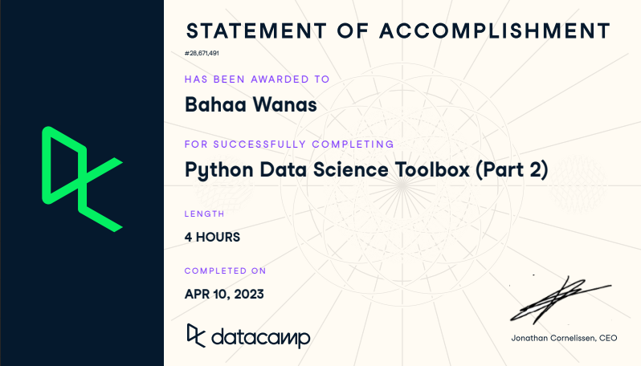  

   - **Data Manipulation with pandas**  
     - Successfully completed a 4-hour course focusing on data wrangling and manipulation using pandas in Python.  
     - 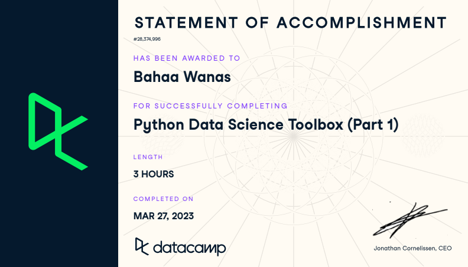

---

## Contact and CV
Feel free to reach out or explore more about my work!

- **[My CV](https://drive.google.com/file/d/1Widi2xcEXcWbIkJpIwSHg-DOuTz2mXji/view?usp=sharing)**
- **[Bahaawanas427@gmail.com](mailto:Bahaawanas427@gmail.com)** 
- **[LinkedIn](https://www.linkedin.com/in/bahaa-wanas-9797b923a)**

--- 
